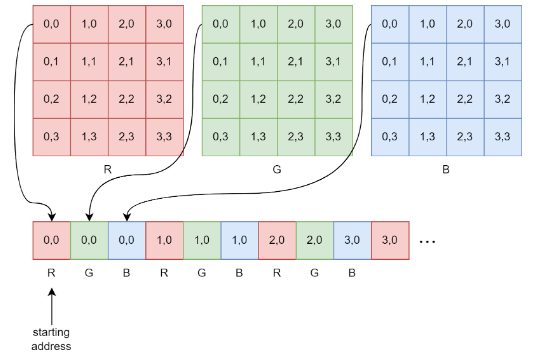

# Image-Processing
Performing image convolution on STM32F4 MCU comprising of Cortex-M4 processor core. Optimized the multiply and accumulate operation by utilizing flynn's taxonomy single-instruction, multiple-data system and loop unrolling technique for successfully meeting frame-based sampling requirements.

## Image formatting in memory 

